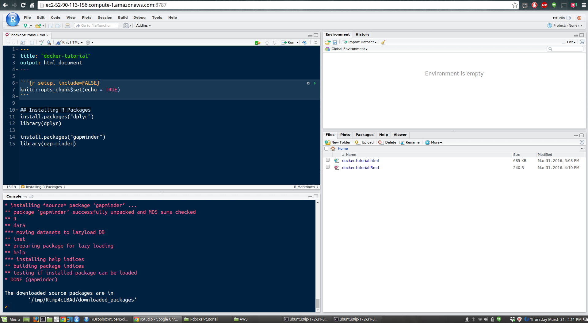

```{r knitr_init, echo = FALSE, cache = FALSE}
library(knitr)

## Global options
options(max.print = "75")
opts_chunk$set(cache = TRUE,
               prompt = FALSE,
               tidy = TRUE,
               comment = "> #",
               message = FALSE,
               warning = FALSE)
opts_knit$set(width = 75)
```

## Lesson Objectives

- Launch RStudio inside of a Docker container
- Linking a volume to a Docker container
- Load into the container plotting it

## Installation

First things first: **install Docker**: on [Linux](https://docs.docker.com/linux/step_one/), [Mac](https://docs.docker.com/mac/step_one/), or [Windows](https://docs.docker.com/windows/step_one/). These install guides link to a bunch of introductory material after installation is complete; it's not necessary to complete those tutorials for this lesson, but they are an excellent introduction to basic Docker usage.

## Launching RStudio in Docker

The first thing we need to do to launch Docker is to open a Unix Shell. If you're on Mac or Windows, in the last step you installed something called the *Docker Quickstart Terminal*; open that up now - it should look like just a plain shell prompt (`~$`), but really it's pointing at a linux virtual machine that Docker likes to run in, and this is where you should do everything for the rest of this tutorial unless otherwise noted. If you're on a linux machine, then you can just use a plain old terminal prompt. 

On a Mac you can also go to your terminal of choice and configure it for Docker usage. Especially if you get the error *Cannot connect to the Docker daemon. Is the docker daemon running on this host?* at some point in the tutorial, running the following command might fix your problem:

~~~
eval "$(docker-machine env default)"
~~~


Next, we will ask Docker to run an image that already exists, we will use the hadleyverse Docker image from [Rocker](https://github.com/rocker-org/rocker/wiki) which will allow us to run RStudio inside the container and has many useful R packages already installed. 

Optional:
*`p` and `--rm` are flags that allow you to customize how you run the container. `p` tells Docker that you will be using a port (the location of which we specify afterwards as `8787:8787`). This is necessary to run RStudio in the container. Finally, --rm ensures that when we quit the container, the container is deleted. If we did not do this, everytime we run a container, a version of it will be saved to our local computer. This can lead to the eventual wastage of a lot of disk space until we manually remove these containers. Later we will show you how to save your container if you want to do so.*

~~~
docker run --rm -p 8787:8787 rocker/hadleyverse
~~~

Optional:
*If you try to run a Docker container which you have not installed locally then Docker will automatically search for the container on Docker Hub (an online repository for docker images) and download it if it exists.*

The command above will lead RStudio-Server to launch invisibly. To connect to it, open a browser and enter `http://`, followed by your ip address, followed by `:8787`. If you are running a Mac or Windows machine, you will find the ip address on the first line of text that appeared in your terminal when you launched the Docker Quickstart Terminal. For example, you should see:

~~~

                        ##         .
                  ## ## ##        ==
               ## ## ## ## ##    ===
           /"""""""""""""""""\___/ ===
      ~~~ {~~ ~~~~ ~~~ ~~~~ ~~~ ~ /  ===- ~~~
           \______ o           __/
             \    \         __/
              \____\_______/


docker is configured to use the default machine with IP 192.168.99.100
For help getting started, check out the docs at https://docs.docker.com
~~~

Thus, you would enter `http://192.168.99.100:8787` in your browser as the url.

If you are running a Linux machine, you can use `localhost` as the ip address. For example: `http://localhost:8787`

This should lead to you being greeted by the RStudio welcome screen. Log in using:

username: rstudio
password: rstudio

Now you should be able to work with RStudio in your browser in much the same way as you would on your desktop.

The image below shows RStudio server running within a docker image. You should see something similar on your machine.



Try to now look at your files of your virtual computer (docker container). Go to
file -> open file. You will see that there are actually no files. The reason for
this is that this image came with no files.
Next, open a new R Script, e.g. by going to file -> New file -> R Script. 
Enter the following code in the script, run it and save it.

~~~
# make x the numbers from 1 to 5, and y the numbers from 6-10
x <- 1:5
y <- 6:10

# plot x against y
plot(x, y)
~~~

If you look at your files again now, you will see the script file.

Now, given that we used the `--rm` flag when we launched the Docker container, anything we create on the machine will be gone. Let's verify this. First, close the browser tab where you have RStudio open, and then go to your terminal window from where you launched the Docker container and type Contol+C. This shuts down the 
Docker container.

Now relaunch your a Docker container using the RStudio image as you did previously, e.g., `docker run --rm -p 8787:8787 rocker/hadleyverse` in the terminal and typing `http://192.168.99.100:8787` in your browser window and see if the rscript and plot you saved is still there.


## Linking a volume to a Docker container to access data and save files

That leads us to the question of, how can we save our work if the container is deleted when we exit the container? One solution is to link a volume (for example your local hard drive) to the container so that you can access the data there as well as being able to save things there.

This time when we launch our container we will use the `-v` flag along with the path to our projects root directory. Your launch command should look something like this, although the path will differ depending on where you saved the data to on your computer and on the container. On the left hand side of the `:` is the path
on your own computer. On the right hand side is the path on the container. This
should almost always start with `/home/rstudio/`.


~~~
docker run --rm -p 8787:8787 -v /Users/tiffanytimbers/Documents/DC/r-docker-tutorial:/home/rstudio/r-docker-tutorial rocker/hadleyverse
~~~

Again, you will have to enter something like `http://192.168.99.100:8787` in your browser as the url to get RStudio to run. 

This time when you launch RStudio in a Docker container and you try to open a file you should be able to see some files and directories. Now set the working directory to the directory called `r-docker-tutorial` and load the `gapminder-FiveYearData.csv` into R via `read.table`.

~~~
# load gapminder data from a csv on your computer
gap5yr <- read.csv(file = 'data/gapminder-FiveYearData.csv')
~~~

Now lets plot GDP per capita against  life expectancy.

~~~
# load ggplot library
library(ggplot2)

# plot GDP against  life expectancy
qplot(gap5yr$lifeExp, gap5yr$gdpPercap)

# save the plot
ggsave(filename = 'data/GDP_LifeExp.pdf')
~~~

Let's also save the script as `plot_GDP_LifeExp.R` in the `r-docker-tutorial` directory. Now close the RStudio browser and exit your Docker container via the terminal using Control+C. Then look inside the `r-docker-tutorial` and `r-docker-tutorial/data` directories on your laptop to see if you can see the two files you created.

## Summary

In this lesson we learned how to launch a Docker container that allows us to run RStudio in a browser. We learned that using the `--rm` flag when we run Docker makes the container ephemeral; meaning that it is automatically deleted after we close the container. We do this as to not build up a large collection of containers on our machine and waste space. We also learned that we can link a volume of our laptop to the Docker container if we want to be able to access and save data, scripts and any other files. 

The container we used already had R, RStudio and several useful R packages installed. In later lessons we will learn how to modify this container to install new packages, and where we can find other Docker containers that might be useful for our work.

## Challenge Questions 
TBD


Next: Go to [Lesson 03 Install packages](03-install-packages.html) or back to the 
[main page](http://ropenscilabs.github.io/r-docker-tutorial/).

